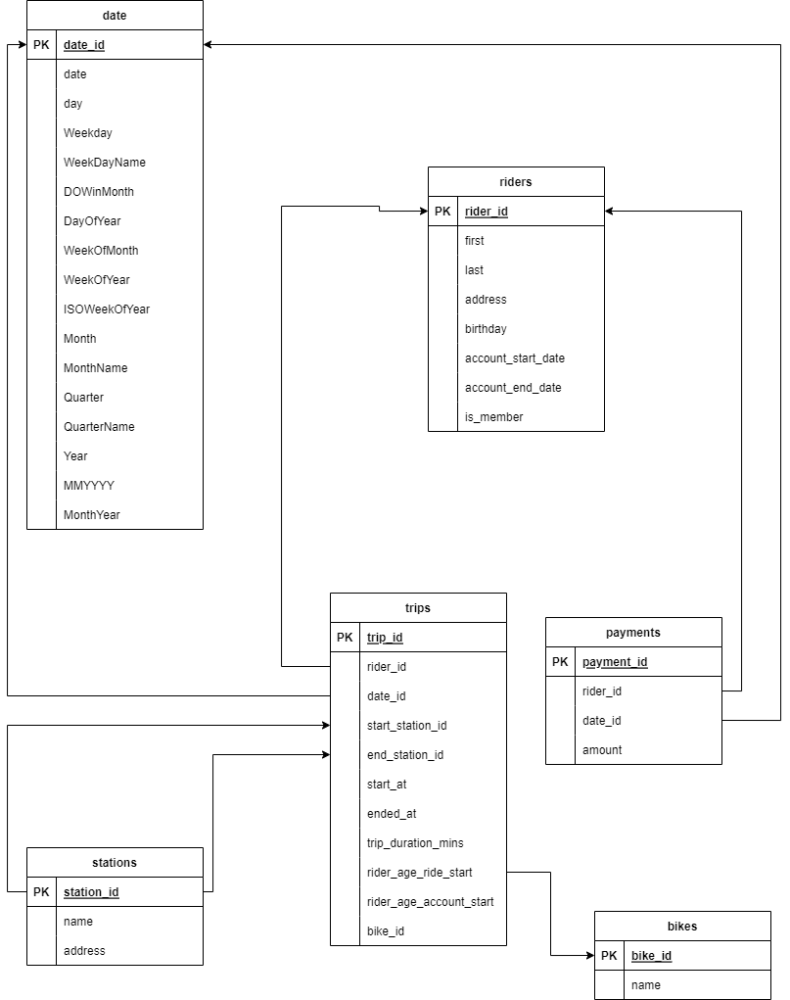
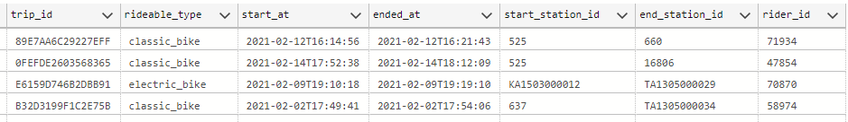
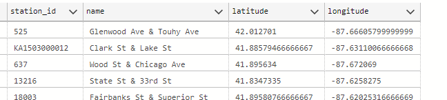
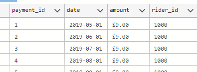
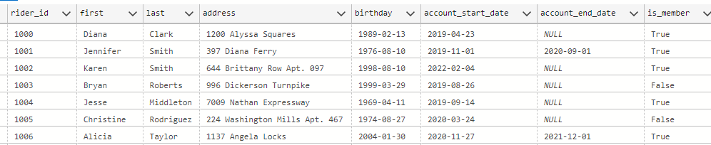
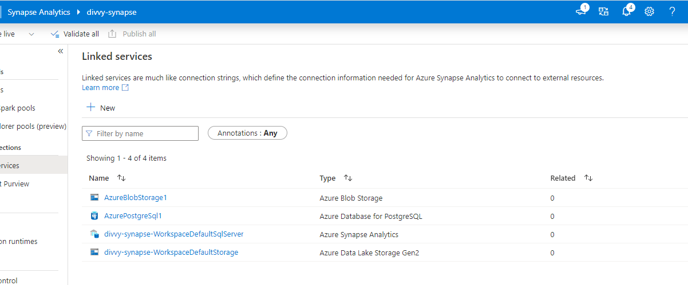
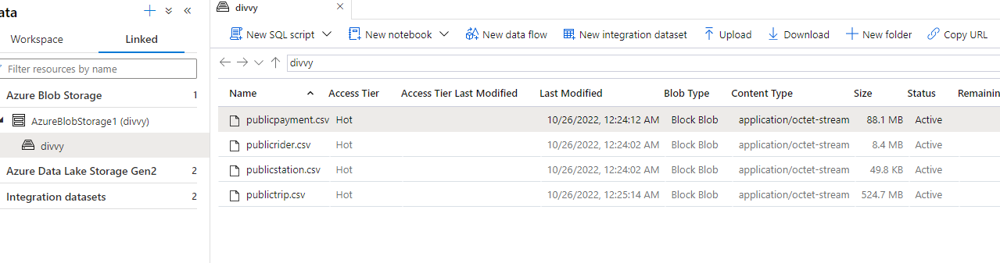
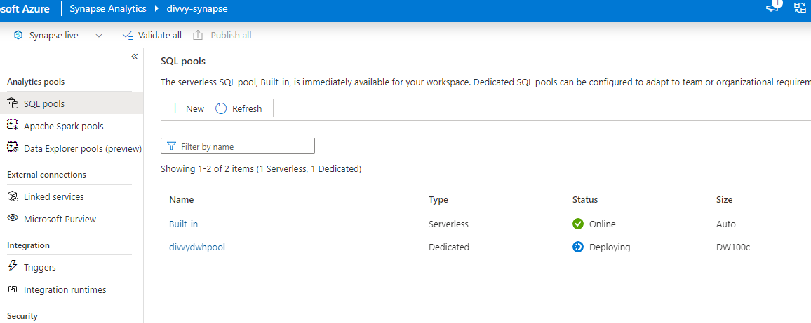

# Building an Azure Data Warehouse for Bikeshare Data Analytics

Divvy is a bike sharing program in Chicago, Illinois USA that allows riders to purchase a pass at a kiosk or use a mobile application to unlock a bike at stations around the city and use the bike for a specified amount of time. The bikes can be returned to the same station or to another station. The City of Chicago makes the anonymized bike trip data publicly available for projects like this where we can analyze the data.

The goal of this project is to develop a data warehouse solution using Azure Synapse Analytics. It involved:

* Designing a star schema based on the business outcomes listed below;
* Importing the data into Synapse;
* Transforming the data into the star schema;
* and finally, viewing the reports from Analytics.

## Dataset
The data contains 4 initial tables:
* trip with 4584921 records

* station with 838 records:

* payment with 1946607 records:

* rider with 75000 records:

## Extract and Load
In Azure synapse, linked services were set up to postgres and azure blob storage.

Using postgres as source and azure blob storage as destination, the 4 tables were ingested into blob storage and saved as comma delimited files.

In Azure Synapse, the 4 files were loaded as external staging tables `trip`, `payment`, `rider`,`station` into Azure SQL pool via Polybase. 

Transformation scripts were written to create final tables according to the star schema: fact tables `trips` and `payments` and dimension tables `riders`, `date`, `stations`

## Transform

Transformation was done in line with the entity relationship diagram as guiding architecture. SQL scripts are in the sql folder.

## Challenges
1. Initially, setting up data source for copy task could not connect to postgres database with error `no pg_hba.conf entry for host "4X.XXX.XX.XXX", user "userXXX", database "dbXXX"`. It was resolved by enabling encryption.

2. Data files were too heavy to commit to github. Push command kept failing with `Large files detected.` even after these files have been uncommitted. It turns out they were still in git log history and had to be forced out via `git filter-branch --index-filter "git rm -r --cached --ignore-unmatch data" HEAD`

3. Creating a date dimension in Azure Synapse came with challenges as I could not use recursive CTEs which was the first approach I attempted. I adapted the [Azure SQL script for creating date timension by Meagan Longoria](https://datasavvy.me/2016/08/06/create-a-date-dimension-in-azure-sql-data-warehouse/) to resolve the challenge.
